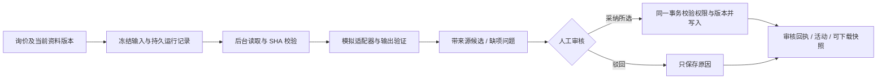

# F2：资料候选与人工审核（模拟测试）

本批按用户确认的范围实现明确标识的模拟闭环。没有配置模型供应商，没有模型请求或费用。固定标签匹配只用来验证软件流程，不代表语言理解、图纸识别或实际模型准确率。

## 一次完整操作

1. 用销售账号进入成套或钣金询价，打开“AI 辅助”，下载对应的虚构示例 TXT。
2. 在“资料”上传示例；返回“AI 辅助”，勾选资料当前版本，默认使用正常提取，特殊演练在“演示工具”中选择。
3. 点击“开始模拟提取”。运行进入后台，关闭页面后仍保留；相同发起人、记录与资料快照、适配器版本、场景会打开原运行，不重复建单。
4. 待审核后，查看客户名称、期望交期、需求说明的候选；点击来源查看冻结文本、行号和文件版本，也能下载对应原件。
5. 负责人勾选需要采纳的字段，可人工修改候选值；填写审核说明，点击“确认并更新 N 项”。未勾选字段保持原值。
6. 也可填写原因后驳回。技术协作者可以发起、查看和核对，正式采纳或驳回由负责人/管理员完成。
7. “历史”和运行详情保存审核人、原候选、人工修改、前后值与版本。导出的 ZIP 同时包含运行、来源文本和审核回执。

尚未审核的运行会阻止归档；先审核或取消。取消的运行保留历史，同一输入再次提交仍打开原记录；需要新一轮提取时先更新资料/记录版本。失败运行在输入未变且有权限时可显式重试，最多三次。待审核的旧快照可驳回或取消，不能采纳。

## 本批解析范围

仅 UTF-8（可含 BOM）的 TXT/CSV，每份最多 200,000 字节、40,000 字符，单行不超过 5,000 字符，每次 1–5 份不同资料的当前版本。行分隔符统一后保存文本快照，文件原件与原始字节摘要保持不变。

匹配每行开头的固定标签，分隔符支持中英文冒号/逗号：

```text
客户名称：DEMO 示例客户
期望交期：2026-12-20
需求说明：DEMO 参数待技术核对。
```

客户名称最多 140 字、期望交期必须是有效的 `YYYY-MM-DD`、需求说明最多 4,000 字。标签缺失就列出待补充问题；同一字段存在不同值时提示冲突并不生成该字段候选。不读取 CSV 表格任意列、不猜测缺失项；PDF、扫描件、图片、Office、DXF 本批保存原件但不参与模拟解析。

这些字段是验证审核动作的框架示例，不是企业最终字段模型。没有计价、工程选型、正式报价、合同、生产放行或对外发送。

## 数据与执行边界



- `JN AI Run` 保存发起人、模式、适配器和输出约定版本、原询价/资料快照、状态、执行次数、错误、时间、候选与用量。`JN AI Review` 是不可覆盖的审核回执。
- 写入动作与 F1 共用权限、事务锁、请求回执、字段验证和版本递增。只有白名单字段可采纳；模型输出不能选择 SQL、角色、文件路径、供应商或任意工具。
- 来源资料始终当作待分析内容；其中出现“忽略规则”等文字不改变代码执行流程。模拟器没有网络调用能力。
- 资料版本/询价内容变化会使原候选过期。采纳时重新核对当前访问权限、记录版本和原始候选来源，不以浏览器按钮状态作为保障。
- 数据库是任务状态依据，Redis 是投递渠道。任务提交后再入队；入队失败保留排队状态，由每分钟恢复任务重新投递（调度器每 30 秒检查是否到期）。运行记录先持久声明执行权，重复队列消息不能重复处理。
- 模拟执行超过 120 秒仍未完成时，恢复器改变执行令牌，最多重新执行至第三次；旧 worker 的迟到结果不能覆盖新运行。此恢复仅适用于无外部副作用的模拟器。真实模型的外部结果不确定时必须先核对，不能直接套用模拟自动重试。
- “首次失败演练”首轮明确失败，人工重试同一运行后可继续；“结果不确定演练”停在结果待核对，不自动或手动重试，可以取消并保留历史。
- 页面列出最近 100 次运行；完整导出读取本询价所有运行，受既有 ZIP 大小上限约束。来源快照和审核记录跟随询价当前权限，不可单独分享。

## 运行与验收

```bash
python scripts/test_ai_contract.py
python scripts/smoke_ai.py
```

恢复验收会临时停止本项目 worker/scheduler，不应在其他人使用此演示站点时并行运行：

```bash
python scripts/smoke_ai.py --prepare-restart
docker compose run --rm init-site
python scripts/dev.py restart
python scripts/smoke_ai.py --verify-restart
```

准备阶段保留真实已排队记录，并通过本机管理命令插入一个“模拟过期执行占用、没有队列消息”的故障夹具。重启后由正常恢复器处理，验证不依赖 Redis 消息仍能找回任务。该夹具不代表已经测过真实供应商超时/计费不确定性，也不是对 worker 进程的随机强杀测试。

报告在忽略目录 `.local/acceptance/`；恢复检查标识在 `.local/f2-restart-probe.json`。重复初始化和恢复保留原运行编号及审核回执。备份创建与隔离恢复演练是不同事项。

## 接入真实模型前的下一步

确认供应商、具体模型、允许提交的样本及用量限制后，再实现对应适配器和受控凭据配置。保持相同的输入/输出约定、来源验证、权限和人工写入入口；以单独验收集评测漏项、错误来源、冲突处理、超时、失败与实际用量。模拟数据的零费用不能外推为真实运行成本。

## JN-0005 核对界面

桌面把来源原文和候选字段并排展示；点击来源会定位并高亮原文行，手机以候选/原文切换。底部核对区列出选择数量和审核说明。未选择字段保持原值，一次审核结束后显示实际写入的前后值与审核人，原候选折叠保留。模式始终标识为“模拟测试”；历史快照不可直接采纳。页内离开、切换运行和取消处理使用应用确认窗口，关闭浏览器时使用浏览器自身的未保存提示。
