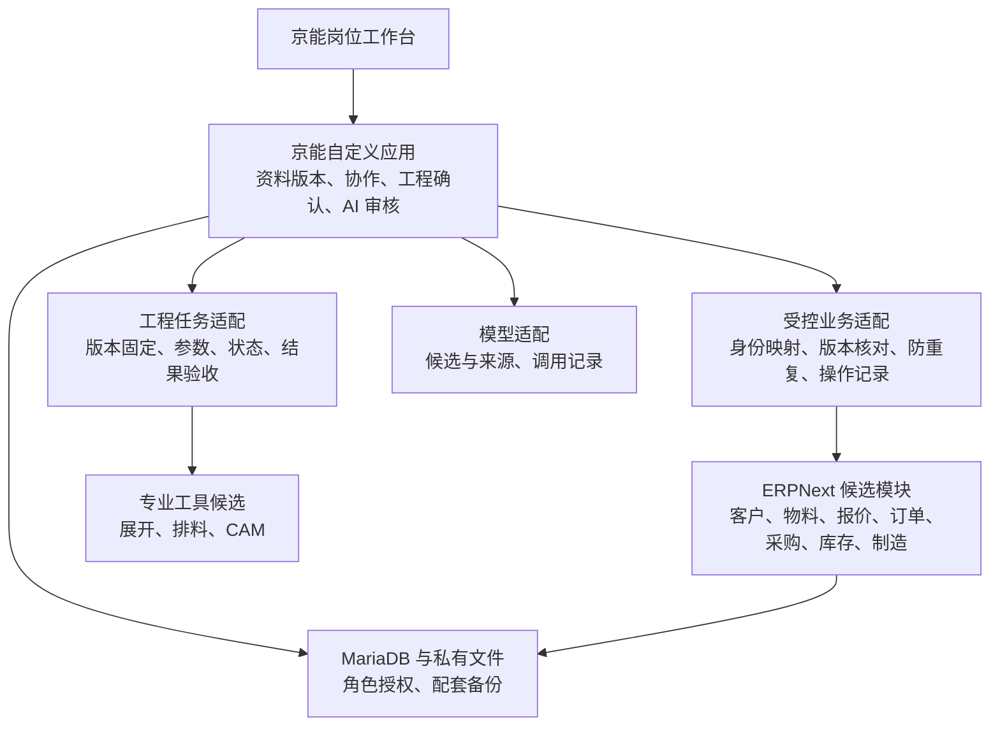

# 开源复用与工程工具适配评估

更新编号：JN-0006。核对日期：2026-10-10。适用基线：JN-0005 / 应用 0.3.0。

本文件是技术选型与实施边界的评估，不表示候选已经安装、接口已经接通或真实订单已经验收。下一批的执行范围与通过条件见 [最小验证方案](next-validation.md)，固定来源见 [来源清单](sources-jn-0006.json)。

## 结论与决定状态

**建议保留现有京能工作台和 Frappe 自定义应用，优先在隔离环境验证 ERPNext 标准业务模块；ΣEM 作为钣金流程和数据设计的对照，SheetNest 作为独立工程工具候选。**依据是当前代码可延续、标准业务对象有上游实现，以及不同技术栈和工程计算的接入边界；不是候选性能或工厂适配已经获证。

| 状态 | 内容 |
| --- | --- |
| 用户已确认 | 先为自己的工厂落地；以开源为基础，吸收商业软件解决具体问题的方法；对外产品化后续再评估 |
| 已有实现 | Frappe 自定义应用、紧凑工作台、询价/产品行、原件版本、协作任务、模拟候选/人工审核、活动记录与资料包 |
| 本批核实 | 当前容器报告 Frappe 16.51.0、京能 0.3.0、Python 3.14.8；当前 Frappe/Python 版本满足所选 ERPNext 源码声明的范围 |
| 本批建议 | 先验证 ERPNext 的客户、物料、报价与订单映射，再逐步复用制造和库存；专业几何能力独立验收 |
| 尚未决定/验证 | 正式安装 ERPNext、企业主数据和岗位权限、正式报价规则、CAM/设备适配、真实模型供应商及几何工具选型 |

现有应用与验收范围以 [项目进度](../project-context.md)、[JN-0005](../changes/JN-0005.md) 为准。本批只读核对运行版本，没有重复执行上批的完整浏览器/API 验收。

## 已核实的重要修正

此前讨论中“ΣEM 开源版内置矩形排料”的描述，不能继续作为当前版本的接入依据。本次固定到 `6cd15090949f0a66ea28380c7e0751ab63aea94c` 后发现：

- README 将排料计算列为商业版能力。
- `NestingController::compute` 在 `services.nestengine.enabled` 为假时返回 403；引擎不可达时返回 503。
- 上游 `NestingComputeTest` 明确断言无引擎时拒绝计算，不存在本地回退计算。

这是对该固定提交的源码核查，本批没有运行其 PHP 测试，也没有追溯何时发生变化。不能用一个准备页面、外接矩形计算文件或 API 路由的存在，推定有完整可复用排料引擎。[源码](https://github.com/SMEWebify/WebErpMesv2/blob/6cd15090949f0a66ea28380c7e0751ab63aea94c/app/Http/Controllers/Planning/NestingController.php#L177)、[测试定义](https://github.com/SMEWebify/WebErpMesv2/blob/6cd15090949f0a66ea28380c7e0751ab63aea94c/tests/Feature/NestingComputeTest.php)

## 固定候选与证据等级

- **运行证据**：明确运行过的命令、结果、环境与样本。
- **源码证据**：在固定提交读取到对象/控制器/依赖声明；不代表实际运行通过。
- **文档声明**：官方描述或厂商宣称；需要复现才能升级为运行证据。
- **设计建议**：本项目拟采用的分工和规则；尚未实施。

| 对象 | 本批固定版本/提交 | 证据与用途 | 未获证的部分 |
| --- | --- | --- | --- |
| 当前 Frappe | 16.51.0 / `6b450a166e076dd842e4db7ea0843f62881e62ac` | 当前容器版本与 [依赖基线](../../infra/versions.json) 对应；继续承载自定义应用 | 安装新应用后的共存回归未做 |
| ERPNext | v16.50.0 / `7474d9e786277383de1242ab882f16856d17a9c9` | 读取 12 个业务 DocType 定义、报价/BOM/工单控制器、安装钩子及依赖；优先验证标准业务复用 | 安装、数据库迁移、默认配置、权限、价格及库存记账未实测 |
| ΣEM / WebErpMesv2 | WEM-2.0 当次提交 `6cd15090949f0a66ea28380c7e0751ab63aea94c` | Laravel/PHP 系统；读取架构、任务模型、接口和排料边界；参考工序/成本/资料关联 | 不是 Frappe 插件；跨栈移植、中文操作及真实业务能力未验收 |
| SheetNest | v1.1.11 / `4f2db7f661376c89eb87704421380969a5801213` | Windows WPF；展开服务调用 FreeCAD，排料服务调用 Sparrow 子进程；候选工程工作器 | 本机未安装；未证明有可直接使用的完整 HTTP 服务，也未验证 Linux 迁移、无人值守和几何正确性 |

ERPNext 本次选用的 v16.50.0 声明 Python `>=3.14`、Frappe `>=16.50.0,<17.0.0`。当前版本满足**声明条件**，不构成完整依赖兼容证明。GitHub `releases/latest` 当次返回 v15.122.0，不能将该接口结果直接填进 v16 框架的构建配置；应锁定明确版本及提交。[依赖声明](https://github.com/frappe/erpnext/blob/7474d9e786277383de1242ab882f16856d17a9c9/pyproject.toml)

ERPNext 本身是完整 Frappe 应用。“按模块分阶段复用”指逐步配置和开放业务能力，不意味着销售、库存、制造可以作为互不依赖的插件各自安装。即使第一批只验证报价，也需要相应公司、主数据和默认配置，并检查安装钩子对全站的影响。

## 建议的软件分工

图中 ERPNext、工程适配和真实模型均为建议增量。优先验证同一 Frappe 站点内的独立应用共存，业务操作调用受控服务和上游 DocType 方法，不直接写标准业务表。这样可复用事务和账号体系；仍需核对安装顺序、钩子、附件权限和标准单据入口。

隔离验证使用单独站点、数据库、卷和服务实例，不与当前演示共享数据库或附件。专业工程工作器按实际 OS/依赖需求独立运行；当前不能把 Windows 桌面程序当成 Linux 容器服务。

当前无需同时增加 Dify、LangGraph、n8n、独立 FastAPI 服务和向量数据库。现有 Frappe 服务、队列、角色和持久记录先承担确定的流程；当出现跨系统事件、复杂长流程或文档检索的实测需求，再选择补充组件。MCP 将来只暴露已经具备授权、版本校验与审计的工具动作，不直接提供数据库任意写入。

## 功能适配矩阵

“复用”在本表表示建议路线；除现有京能能力外，均须按 [下一批方案](next-validation.md) 验证。

| 能力 | 当前京能 | 优先复用/参考 | 本项目需要承担的工作 | 验收证据 |
| --- | --- | --- | --- | --- |
| 账号、部门、工作区 | 已有基础账号、9 部门目录、销售/技术演示权限 | Frappe 用户/角色；保留现有前端 | 企业完整岗位授权，标准 ERP 入口与工作台一致授权 | 双角色跨入口越权测试；部门目录不能直接等于授权 |
| 客户、供应商 | 客户名称是询价文本，尚无正式主数据 | ERPNext Customer / Supplier | 人工确认身份映射，保留原始名称；拒绝仅靠同名自动合并 | 同名不同主体、重复导入、原询价追溯 |
| 询价与资料收集 | 已有 JN Inquiry / Document / File Revision | 保留京能 | 结构化导入预览、缺项/冲突提示、旧资料批次追踪 | 上传、二次导入无重复，旧版仍能下载 |
| 产品、组件、零件、物料 | 产品行只有名称/数量/单位/规格，不能充当 BOM | ERPNext Item / UOM；ΣEM 工序关联参考 | 稳定对象身份、工程版本与业务物料映射、单位确认 | 同名不同规格不混并；改图不覆盖历史结构 |
| 商业报价 | 尚未实现正式报价 | ERPNext Quotation | 受控创建、来源快照、成本测算依据和权限；界面嵌入京能工作流 | 两类询价各生成一份草稿；金额有确定计算依据 |
| 钣金成本测算 | 未实现 | 参考 Lantek 的几何/工序计价和 ΣEM 工时模型 | 规则版本、材料与工序输入、缺参阻断；测算与正式报价分开 | 人工可复算；参数变更触发重算且旧结果可追溯 |
| 订单与商业变更 | 未实现 | ERPNext Sales Order / amended_from | 关联报价/来源版本；显示变更影响；分批数量追踪 | 报价转单不丢行、不重复；变更不静默更新已确认下游 |
| BOM 与工艺 | 未实现 | ERPNext BOM / Operation / Routing | 工程版本、物料结构和生产结构的明确转换 | BOM 数量/单位/工序正确；订单绑定固定版本 |
| 采购与外协 | 未实现 | ERPNext Purchase Order / Subcontracting Order / Receipt | 来料、外发、回收、损耗、质检和外协中间品规则 | 外发/回收/不合格数量可对账，不以采购收货代替外协过程 |
| 库存与成品交付 | 未实现 | ERPNext Stock Entry / Delivery Note | 仓库与物料映射、批次/余料身份、分批交付；只由库存单据记账 | 出入库可回溯，取消/退货不破坏数量，防重复扣减 |
| 生产任务与报工 | 只有协作任务，尚无生产工单 | ERPNext Work Order / Job Card | 现场岗位操作、异常、交接、部分完工/返工 | 工单、工序卡与库存数量一致；协作完成不自动等于生产完成 |
| 质量与返工 | 未实现 | ERPNext Quality Inspection；ΣEM 不合格流程参考 | 检验标准/版本、处置权限、返工路径 | 原批次与返工可关联；不合格不能仅靠页面状态视为已处置 |
| 展开、排料、CAM | 未接入 | SheetNest 候选及现用 CAM | 工程任务、输入/输出映射、参数记录、人工审核、结果有效性 | 数量/单位/方向正确，轮廓无越界重叠；CAM 实际导入另行验收 |
| AI 与知识辅助 | 仅 TXT/CSV 三个固定标签模拟 | 保留来源与审核闭环，替换/扩展模型适配 | 真实调用、解析/OCR、来源定位、评测样本、成本与异常记录 | 采纳前不写正式记录；冲突/过期/缺来源阻断；模拟与真实标识分开 |
| 经营与成本分析 | 活动记录，不是成本账 | ERPNext 标准账/报表；京能专题分析 | 预计与实际关联、统计口径、异常解释 | 任一汇总可下钻到单据/版本，不由模型生成未经核对的数字 |

标准对象与流程依据：[报价及前置数据](https://docs.frappe.io/erpnext/quotation)、[工单](https://docs.frappe.io/erpnext/work-order)、[外协](https://docs.frappe.io/erpnext/subcontracting)，以及来源清单中固定版本的业务对象和控制器。实际字段规则以上游固定源码和后续运行验收为准，网页文档可能随版本变化。

## 数据职责与版本含义

以下是接入后的目标职责，当前并未新建这些对象。

| 数据 | 唯一负责修改的模块 | 其他模块的使用方式 |
| --- | --- | --- |
| 客户需求、沟通资料、原件版本、候选和审核回执 | 京能资料/协作应用 | ERP 单据保存来源引用或固定快照；不另建可独立编辑的原件版本库 |
| 正式客户、供应商、物料、单位 | 通过受控入口写 ERPNext 主数据 | 京能保留身份映射和当时显示值，避免两套主数据同时维护 |
| 零件工程版本、图纸关联、技术确认 | 京能工程对象 | ERP Item / BOM 引用对应的已确认版本；最终编码/版本策略由试验结果决定 |
| 正式报价、订单、BOM、采购、工单、库存、交付 | 对应 ERPNext 标准业务对象 | 京能界面投影/查询或经受控服务提交；不复制维护第二套数量/金额/库存账 |
| 展开、排料计算结果 | 工程任务保存不可覆盖的结果版本 | 技术确认后成为后续计算或单据依据；计算工具不直接扣库存、提交工单 |
| AI 输出 | AI Run / Review 或后续有版本的兼容扩展 | 仅提供候选；确认后经目标业务服务写入 |

需要特别区分三个版本：

1. `JN Inquiry.revision` 是当前协作记录的并发修改序号。
2. `JN File Revision` 是文件上传版本和字节摘要；当前 `JN Document.current_version` 只是最新上传版本号。
3. **工程有效版本**是未来经技术确认、可供报价/BOM/制造引用的业务版本。当前没有该状态，不能自动将“最新上传”视作“已批准使用”。

产品行的 `line_id` 标识一次询价里的行，不等于正式物料编码或跨订单通用零件身份。不同订单采用同一零件时，也要明确引用哪一个工程版本。现有定义：[询价行](../../apps/jingneng/jingneng/workbench/doctype/jn_inquiry_item/jn_inquiry_item.json)、[资料](../../apps/jingneng/jingneng/workbench/doctype/jn_document/jn_document.json)。

## 受控接入约定

### 标准业务适配

- 输入至少包含询价/产品行稳定 ID、来源版本、目标模块、动作、用户身份、预期版本和防重复请求标识；金额、数量和单位必须由明确字段传递。
- 创建动作先验证来源访问权和目标动作授权，再调用标准对象方法。不得把京能内部服务的 `ignore_permissions=True` 用法无条件复制到 ERP 单据。
- 防重复标识相同且负载相同，应返回同一结果；负载不同应拒绝。提交成功但回执丢失时先查询操作记录，不能再次创建单据。
- 标准 API、Desk、导入、后台任务等所有可写入口，都必须遵守源资料版本约束和授权。仅隐藏按钮不足以限制写入。
- 同站点的数据修改尽量放在一个数据库事务；涉及外部工具时采用持久任务和可恢复状态，不假定跨进程操作天然具备一次性事务。
- 文件权限仍从所属业务对象校验；连接 ERP 单据时不能因添加一个附件关联就扩大原件可见范围。

当前有 File 类覆盖、附件权限、DocShare 钩子和并发登录钩子；所选 ERPNext 还存在针对全部文档的 validate 钩子及 User 事件。源码未显示 ERPNext 在本次读取的 hooks 中也覆盖 File，但不能据此免除共存回归。[当前钩子](../../apps/jingneng/jingneng/hooks.py)、[ERPNext 钩子](https://github.com/frappe/erpnext/blob/7474d9e786277383de1242ab882f16856d17a9c9/erpnext/hooks.py)、[Frappe 扩展机制](https://docs.frappe.io/framework/user/en/python-api/hooks)

### 工程计算适配

建议任务记录至少包含：任务 ID、请求标识、来源对象/工程版本、每个文件的摘要、物料/板厚/单位/数量、板材规格、工具及算法版本、已知工艺限制、结果文件与摘要、完成/失败/未知状态、校验结果和人工审核。

同一输入重试不能重复入账；发生改图时，旧计算结果仍保留，但不自动作为新版本依据。混排需要将每个放置实例映射回订单行和零件版本，实际材料消耗与余料归属按经过确认的规则记录，不能只写一个“材料利用率”。

先验证人工导出/回传可追溯资料包，再验证 CLI/工作器自动执行。不能以一次脚本成功退出、一个 DXF 文件存在或一个看似正确的预览作为工程验收。SheetNest 的展开/排料与 CAM 刀路仍需分别验证。[展开调用](https://github.com/ManuelMRosa/SheetNest/blob/4f2db7f661376c89eb87704421380969a5801213/DeepNestLib.Core/IO/StepUnfoldService.cs)、[排料调用](https://github.com/ManuelMRosa/SheetNest/blob/4f2db7f661376c89eb87704421380969a5801213/DeepNestSharp/RasterNest/SparrowNestService.cs)、[官方 CAM 边界](https://sheetnest.io/plasma-cutting-nesting-software/)

### AI 适配

当前适配器只允许客户名称、期望交期、需求说明三个字段，来源是 UTF-8 TXT/CSV 的原文行；其结果校验还固定检查模拟用量。接入真实模型必须显式扩展适配器及验证约定，不能仅换一个 API 地址后声称支持工程识图。[当前适配器](../../apps/jingneng/jingneng/ai/adapter.py)

第一批真实模型仍可沿用这三个字段测试自然语言理解。PDF/图片解析、页码/区域坐标、零件参数提取作为后续独立能力评测。缺失尺寸保持缺失；文档中的文字不得作为模型执行工具的指令。AI 无权自行批准工程版本、发送报价或扣减库存。

## 商业方案如何转为自己的可验收功能

| 参考对象与官方声明 | 需要解决的问题 | 我们拟独立实现的机制 | 最小验收例 |
| --- | --- | --- | --- |
| [Lantek 几何/工序与报价关联](https://www.lantek.com/industrial-erp-software/advanced-manufacturing-crm) | 改图后原报价依据不清 | 报价绑定工程版本和规则快照；变更影响标记 | 图纸 V2 改变板厚后，V1 报价仍可追溯，新报价必须重算 |
| [SigmaMRP 与业务/排料系统协同](https://www.sigmanest.com/en/sigmamrp) | 数量、材料与交付记录分离 | 从订单行到排料实例、用料单据的关联 | 两订单混排后按零件核对数量，消耗记录不重复 |
| [固美特 工序/齐套/扫码流程](https://www.szgoodmate.com/ERPMES/89.html) | 工序完工后找不到零件、装配缺件不明 | 简短报工、位置/交接状态、组件齐套查询 | 部分完工时显示准确缺件及所在工序 |

表中机制是本项目的建议，不是厂商承诺向我们提供接口，也不是已复制的商业算法。厂商页面的客户数量、节省比例等宣传数据不作为本项目收益承诺。Oseon 页面本次读取超时，不作为本轮新增结论的证据。

## 许可、维护与正式落地边界

本次读取的 ERPNext 主许可为 GPL-3.0，ΣEM 和 SheetNest 主许可为 MIT；SheetNest 还列出 FreeCAD/SheetMetal、jagua-rs 等第三方组件的 LGPL/MPL 等许可。主许可不代表所有可下载服务或付费引擎均可自由复用。[ERPNext](https://github.com/frappe/erpnext/blob/7474d9e786277383de1242ab882f16856d17a9c9/license.txt)、[ΣEM](https://github.com/SMEWebify/WebErpMesv2/blob/6cd15090949f0a66ea28380c7e0751ab63aea94c/LICENSE)、[SheetNest 第三方声明](https://github.com/ManuelMRosa/SheetNest/blob/4f2db7f661376c89eb87704421380969a5801213/THIRD_PARTY_NOTICES.md)

本批没有复制这些上游实现到应用中，也没有修改京能当前的许可标识。后续直接移植代码时记录来源、许可和修改；对外分发或产品化前，按具体组合与交付形式核对义务，不能仅凭“内部使用”推导任意外部交付均无条件可行。

库存/成本/会计需一套权威账。通用发票、国外本地化和演示价格都不等于已满足企业财务制度及中国税务开票需求。正式生产前还需权限适配、成套/钣金真实样本验收、配置/数据库/附件配套恢复验证。真实字段后补不妨碍先用虚构数据验证这些技术边界。

## 下一批建议

**先做隔离的 ERPNext 共存与双业务报价草稿验证。**它能够先回答“现有工作台能否复用标准单据、是否造成重复数据和权限回退”。通过后再扩展工程结构、BOM 和制造；若失败，保留失败证据并缩小接入范围。完整步骤、样本与停止条件见 [下一批最小验证方案](next-validation.md)。
