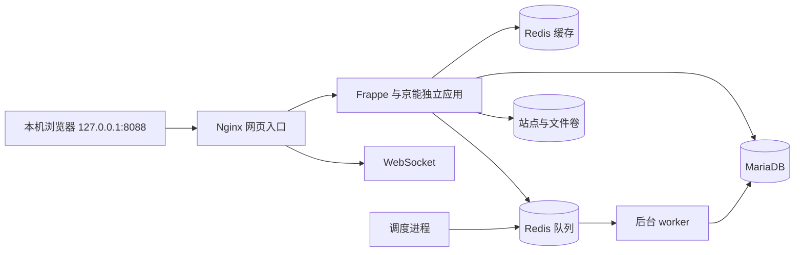

# 第一批：运行环境与基础结构

本批次使用 Frappe 独立自定义应用，在本机 Docker Linux 容器中运行。应用代码位于 `apps/jingneng`；不修改 Frappe 上游核心，不安装 ERPNext 业务模块。全部示例均为 DEMO。

实际验收状态见 [JN-0002](changes/JN-0002.md)，不要只凭存在启动配置就认定本机已运行。

## 需要的环境

- Git、Python 3.10 或更新版本（仅用于运行本仓库的管理/验收脚本，无第三方 Python 依赖）。
- Docker Engine 23 或更新版本、支持 Compose V2 命令的 Docker Compose，使用 Linux 容器。
- Windows 需要可用的 WSL2/Docker Desktop。应用的 Python、Node、MariaDB 和 Redis 均在容器里，不安装进 Codex 或 Agent Reach 的 Python 环境。
- 首次构建需要访问 Docker Hub、GitHub、Python 与 Node 软件包仓库；后续可复用本机镜像缓存。
- 当前验收平台为 `linux/amd64`。其他架构和另一台电脑需要独立验证。

## 第一次启动

在仓库根目录运行：

```bash
python scripts/dev.py doctor
python scripts/dev.py init-env
python scripts/dev.py start
```

启动脚本生成本地 `.env` 与随机初始密码，构建镜像、等待数据库/缓存就绪、创建站点并安装应用，然后启动服务。初始化失败会停止并保留现场，不自动重装站点或删除数据卷。

默认入口：<http://127.0.0.1:8088/foundation>。未登录时跳转登录页。账号与首次生成的密码在本机 `.local/demo-credentials.txt`，该文件不得提交。

| 账号 | 当前用途 |
| --- | --- |
| Administrator | 站点管理与演示数据维护 |
| sales.demo@example.invalid | 销售演示账号；当前只读演示记录，可执行环境检查 |
| tech.demo@example.invalid | 技术演示账号；当前只读演示记录，可执行环境检查 |

两个演示账号当前使用相同的演示角色，不能视为已经实施企业真实岗位权限。9 个部门目录、成套/钣金各一条演示记录用于连接与持久化验证，不是真实订单模型或已实现的售前流程。

如果 8088 被占用，复制 `.env.example` 为本机 `.env`，选择空闲 `HTTP_PORT` 并填写三个不同的随机密码（至少 16 字符）；或者先释放明确属于自己的端口，再由脚本生成配置。不要删除其他项目的容器来腾端口。

重复执行不会覆盖既有 `.env`，重复初始化不会重置密码或覆盖已修改的示例记录。修改 `.env` 中的初始密码不会自动更改已有站点的密码，账号修改须在应用中执行。

## 常用操作

```bash
python scripts/dev.py status
python scripts/dev.py stop
python scripts/dev.py start
python scripts/dev.py restart
python scripts/smoke.py
docker compose logs --tail 100 backend worker init-site
```

`stop`/`restart` 保留数据卷。不要运行 `docker compose down -v` 或全局清理 Docker 卷；那会删除数据。开发修改后运行 `start` 重建自定义应用镜像，代码以仓库为准，不在运行容器里长期修改代码。

首次初始化失败后修复原因并重试；如果 `site_config.json` 存在但数据库不完整，脚本会报错保留现场，需要诊断具体失败阶段，不能直接把它当作可删除的空站点。

## 服务与持久化



| 服务/卷 | 用途 |
| --- | --- |
| `init-site` | 一次性站点创建、应用安装/迁移和演示初始化；正常退出 0 是成功状态 |
| `backend`、`frontend`、`websocket` | HTTP 应用、静态资源与实时连接 |
| `worker`、`scheduler` | 后台任务执行与定时调度 |
| `db-data` | 结构化数据，包括账号、权限及演示记录 |
| `sites` | 站点配置、加密密钥、私有/公开文件及站点备份 |
| `queue-data` | 队列持久化；它不替代未来正式业务任务账本 |
| `logs` | 应用日志；不能当作业务数据备份 |

服务通过本项目的 Compose 网络连接。只把网页端口绑定到 `127.0.0.1`；数据库、Redis 和后台服务不对宿主机开放端口。当前部署是本机开发演示配置，未验收互联网发布或正式生产。

## 源码边界

```text
apps/jingneng/           独立 Frappe 应用
  jingneng/foundation/  部门和演示资料 DocType
  jingneng/api/         登录后调用的基础接口
  jingneng/ai/          明确禁用的模型入口，F2 再实施
  jingneng/www/         当前基础环境验收页
  jingneng/public/      验收页样式与交互
infra/                  镜像、版本与容器初始化
scripts/                启动、检查和 HTTP 验收
docs/                   方案摘要、运行与更新记录
.env / .local/          本机凭据、报告与备份；不提交
```

F0 验收页使用 Frappe 原生页面机制。Vue/Frappe UI 员工工作台、正式业务对象、资料版本、业务任务和 AI 运行记录属于后续批次。AI 当前返回明确的“未配置”状态，不能伪造模型输出或把队列连通等同于 AI 已完成。

## 验收与证据

普通验收检查登录、两个演示账号、数据库/缓存/队列、只读角色的写入拦截、后台任务实际执行以及检查结果的发起者权限。

```bash
python scripts/smoke.py --prepare-restart
docker compose run --rm init-site
python scripts/dev.py restart
python scripts/smoke.py --verify-restart
```

此过程只修改 DEMO 记录并上传一个私有测试附件：重启前保存检查标识和文件摘要；重复初始化并重启后核对同一记录、稳定编号及附件 SHA-256，成功后恢复记录原来的说明。测试附件保留为验证证据。

`.local/restart-probe.json` 标识这一次测试。已有未完成测试时脚本要求先核对，不重复生成相同测试资料。实际报告输出到 `.local/acceptance/`。测试通过证明基础机制成立，不证明正式企业权限、业务规则或模型准确率已经适配。

## 备份与换电脑

```bash
python scripts/dev.py backup
```

把数据库、站点配置和公共/私有文件的备份复制到 `.local/backups/<时间>/`，同时生成文件大小与 SHA-256 清单。备份可能含密码/加密密钥，不能推送公开仓库。仅创建备份不等于恢复已经验证；正式备份恢复演练在后续验收记录中单列。

换电脑先克隆仓库并检出原分支，安装可用的 Docker Linux 环境，再恢复必要的本机配置和数据。只想创建全新演示环境时使用新的随机配置初始化；保留已有演示数据时必须转移数据库、文件和站点配置，不能在一个全新数据库上仅复制旧的 `site_config.json`。

当前框架源码与基础镜像固定到 [versions.json](../infra/versions.json)。上游 Python 依赖仍含版本范围，所以不能声称任意时间重新构建都逐字节一致；需要完整复现时还须保存验收过的应用镜像和实装依赖清单。

## 上游依据

- [Frappe 16.51.0](https://github.com/frappe/frappe/tree/v16.51.0)：当前框架源码。
- [官方分层镜像构建](https://github.com/frappe/frappe_docker/blob/ca1826c21f7fa5c5b0ace69fd2ab297585154a52/images/layered/Containerfile)：独立应用的容器构建参考。
- [官方 Compose](https://github.com/frappe/frappe_docker/blob/ca1826c21f7fa5c5b0ace69fd2ab297585154a52/compose.yaml)：服务拆分参考。

上游许可证见 [第三方说明](third-party.md)。
