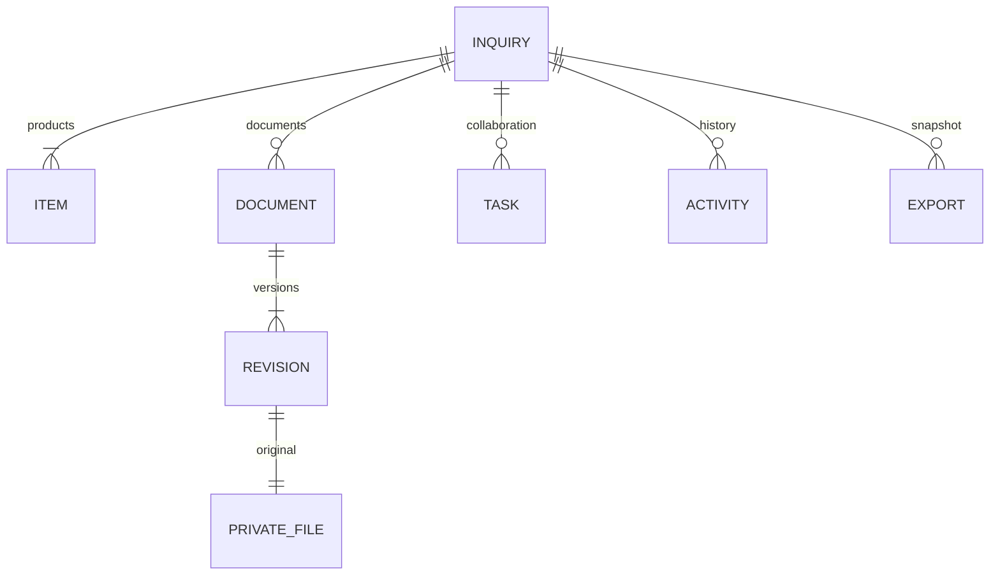

# F1：询价与资料协作工作台

入口为 `/workbench`，基础环境页仍为 `/foundation`。本批使用虚构资料验证成套、钣金两条协作路径，尚未接入真实 AI、计价规则或正式订单。

## 使用路径

1. 销售登录后新建询价，填写客户、业务类型、产品行，并选择技术协作者。真实字段可逐步补充。
2. 在“资料”上传原件；修订时选择同一资料的“新版本”。旧版本保留，可分别下载。UTF-8 文本和 CSV 可预览，其他格式下载查看。
3. 负责人分派问题任务，技术账号从“我的工作”进入并回复。回复进入“待确认”，由负责人确认完成，或填写原因退回、挂起和恢复。
4. “历史”保存操作者、时间、任务状态和内容变化。所有未完成协作任务和未处理模拟运行关闭后可以归档；归档保留数据并支持恢复。
5. 从详情右上角“更多询价操作”点击“生成资料包”，再点击生成项的“下载资料包”。ZIP 中包含 `inquiry.json`、所有原件版本、`manifest.json` 校验清单和说明文件。

导出包是指定时点的业务快照，不是数据库备份。后续数据变化不会改变已生成的包；文件下载仍受当前记录的访问范围限制。

## 服务端权限

| 操作 | 销售/询价负责人 | 已指定的技术协作者 | 管理员 |
| --- | --- | --- | --- |
| 新建询价 | 销售可以 | 不可以 | 可以 |
| 查看询价、版本、历史和导出 | 仅本人负责的记录 | 仅被指定的记录 | 可以 |
| 修改询价和访问范围 | 负责人可以 | 不可以 | 可以 |
| 上传新原件/版本、导出 | 在访问范围内可以 | 在访问范围内可以 | 可以 |
| 分派、确认、退回、挂起/恢复任务 | 负责人可以 | 不可以 | 可以 |
| 回复任务 | 仅自己收到的任务 | 仅自己收到的任务 | 可以 |

这是演示角色和单笔记录的访问规则，不是全企业岗位权限矩阵。部门字段用于资料组织，不自动授予该部门全员访问权限。原协作者还有未完成任务时不能移除，需先完成任务；移除后不再能查看原件，包括其曾上传的原件和既有导出包。

角色限制同时覆盖自定义 API、Frappe 对象读取、列表和文件下载。受管对象只能通过业务动作服务修改，通用 REST、单独分享、把附件改成公开/解绑/删除均受服务端限制。管理员能查看所有记录，但通用 REST 修改仍不能绕过版本服务；拥有数据库或服务器控制权的管理员不在这一应用访问边界内。

## 对象与关系



对应 DocType 为 `JN Inquiry`、`JN Inquiry Item`、`JN Document`、`JN File Revision`、`JN Work Task`、`JN Activity`、`JN Export`，另有内部 `JN Operation` 保存操作回执。主记录和产品行具有稳定编号，业务字段修改不改变编号。文件版本、活动和导出记录创建后不可通过业务接口覆盖。

## 动作边界与重复提交

前端位于 `apps/jingneng/frontend`，采用 Vue 3.5 / Frappe UI 1.0，通过 Frappe 会话和 CSRF 校验调用 `jingneng.api.workbench`。统一业务动作在 `jingneng.workbench.service`，后续 AI 工具也应从此边界进入。

- 每个写入动作传入 `request_id`。同一用户、同一标识、同一内容重试返回原结果；改变内容却复用同一标识返回冲突。
- 涉及已有询价的动作传入 `expected_revision`。整个事务锁定根记录，版本已变化时拒绝覆盖，页面要求刷新核对。
- 操作回执、业务变化和活动记录同事务提交。数据库并发死锁最多重试三次整笔事务；持续冲突返回 409。
- 文件更新比较 SHA-256；同一资料与当前版本内容相同则复用当前版本。不同资料或不同询价不会因为内容相同自动合并业务关联。
- 退回/挂起必须填写原因；已归档询价禁止编辑、上传和任务写入，仍允许查看和导出。

当前上传单文件上限 10 MB，允许 PDF、TXT、CSV、XLSX、DOCX、PNG、JPG/JPEG、DXF。导出原件合计上限 50 MB，含快照的最终 ZIP 上限 64 MB。此处仅保存原件，不代表已识别 CAD 几何、解析 Office 内容或完成病毒扫描。文件不作为可执行指令。大量文件和大包的异步处理、保留策略属于后续扩展。

## 验收与运行

```bash
python scripts/dev.py start
python scripts/smoke.py
python scripts/smoke_workbench.py
```

重启验证在正常环境中执行：

```bash
python scripts/smoke_workbench.py --prepare-restart
docker compose run --rm init-site
python scripts/dev.py restart
python scripts/smoke_workbench.py --verify-restart
```

脚本生成明确标识的虚构记录，验证成套/钣金、授权与越权、文件版本、重复提交、并发修改、任务动作和实际 ZIP 字节。成功验证后归档本轮测试记录，重启探针在等待确认状态保留到重启验证完成。报告保存到被忽略的 `.local/acceptance/`。浏览器页面另行验收，实际结果见 [JN-0003](changes/JN-0003.md)。

F0 升级沿用站点、密码和数据卷，新增模块、角色及演示种子。初始化先清理框架模块缓存再迁移，避免旧站点漏加载新模块。镜像内通过锁文件构建工作台；不要以临时修改容器代替提交源代码与重建镜像。

F2 已实现模拟提取、来源定位与人工审核；真实模型仍待配置。正式报价、价格批准、合同、生产放行以及多组织隔离均不在 F1 已实现范围。

## F2 扩展

询价详情新增“AI 辅助”标签，提供明确标识的模拟提取、来源核对、人工采纳/驳回与持久运行记录。导出包的 inquiry.json 新增 ai_runs，包含原候选、来源与审核回执；两类业务使用相同权限边界。具体使用、解析范围、演练与真实模型接入条件见 [资料候选与人工审核](ai-review.md)。

## JN-0005 界面升级

询价列表支持关键词、业务类型、责任范围和状态筛选，以及完整查询结果的排序、分页；筛选保存在链接中。可选择紧凑/舒适密度与显示列，仅界面偏好保存在当前浏览器。新建/编辑表单保留未提交输入，关闭时确认放弃；遇到版本冲突先展示当前记录与输入差异，明确核对后再重试。

“我的工作”按待我回复、待我确认、AI 待处理和已挂起聚合。服务端使用同一组询价访问条件计算数量与分页，不只统计已加载的第一页。点击待办直达对应询价的任务或 AI 运行。已归档记录、已完成任务、已采纳/驳回/取消运行不会出现在待处理列表中。

资料页按文件与版本浏览，桌面并排预览，手机切换列表/预览；上传成功自动显示当前版本，旧版仍可单独选择。历史默认展示可读变化，演示场景和运行编号收在展开内容中。设计和验收范围见 [工作区设计规范](ui-workspace.md) 与 [JN-0005](changes/JN-0005.md)。
